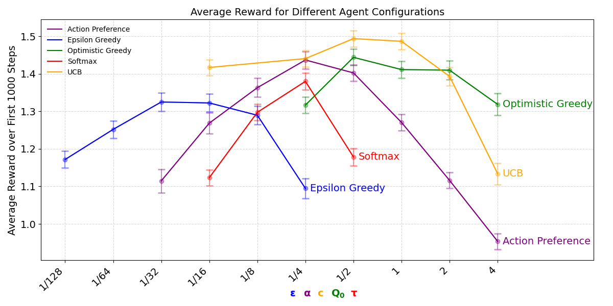
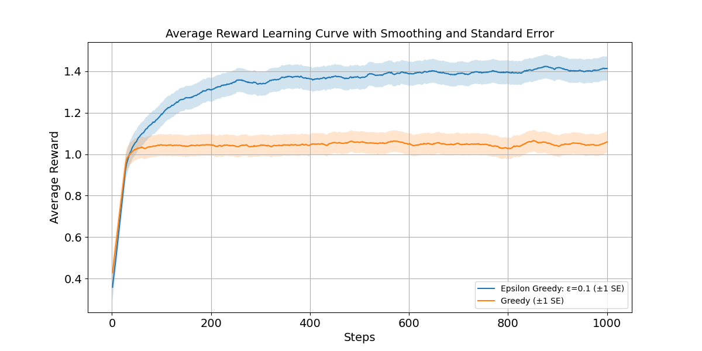

# 🎰 Multi-Armed Bandits Project

This project explores various algorithms and strategies for solving multi-armed bandit problems. 

## 📖 Introduction

A **multi-armed bandit problem** is a classic scenario in reinforcement learning where an agent must choose between multiple actions (**arms**) to maximize cumulative rewards. The key challenge lies in balancing:
- 🔍 **Exploration:** Trying new actions to discover their potential.
- 📈 **Exploitation:** Selecting known rewarding actions to maximize gains.

This repository implements and compares various algorithms for solving these problems, providing an extensible framework for experimentation.

---
## 📂 Project Structure
```plaintext
Reinforcement Learning Project/
├── .github/              # GitHub-specific configurations (e.g., workflows)
├── analysis/             # Scripts and notebooks for analysis
│   ├── hyperparameters.ipynb  # Notebook for hyperparameter analysis
│   ├── learning_curves.ipynb  # Notebook for visualizing learning curves
│   ├── .gitkeep          # Ensures the folder is tracked in Git
├── data/                 # Folder for storing datasets and generated results
├── src/                  # Source code for the project
│   ├── __init__.py       # Marks directory as Python package
│   ├── agent.py          # Implementation of the Agents
│   ├── bandit.py         # Implementation of Bandits
│   ├── experiment_runner.py  # Handles running experiments (strategy pattern)
│   ├── main.py           # Entry point into the program
│   ├── utils.py          # Utility functions (e.g., for plotting or analysis)
├── reports/              # The report for this project
├── .gitattributes        # Git attributes for handling line endings, etc.
├── .gitignore            # Specifies files and directories ignored by Git
├── .python-version       # Specifies Python version for the project
├── pyproject.toml        # Configuration for build tools
├── README.md             # Overview of the project
├── requirements.txt      # List of all required libraries
├── setup.py              # Sets up the project
├── uv.lock               # Lock file for dependency versions
```

## 🏃 How to Run the Project

You can run this project using either a **standard Python virtual environment (NOT RECOMMENDED)** or the **[uv](https://github.com/anishathalye/uv)** dependency management tool. Follow the steps below for your preferred setup. We suggest that you familiarize yourself with ``uv`` so that you also use the correct Python version (3.10) for this project.

---

### **Clone the Repository**:
   ```bash
   git clone https://github.com/RLP-RUG-2024-25/multi-armed-bandits-group10-multi-armed-bandits.git
   cd multi-armed-bandits-group10-multi-armed-bandits
  ```
### Option 1: Using a Virtual Environment and Installing Requirements (NOT RECOMMENDED)

> [!WARNING]
> If you use this method, make sure that you have Python 3.10! Otherwise, the versions required in this project will not work. Alternatively, you can manually install the required libraries from requirements.txt with the latest versions at the time of running. This however might cause additional inconsistencies between versions, so this option is not always guaranteed to work. We recommend that you run this project using **Option 2**, which uses the ``uv`` environment manager, which will sort out the library versions and create a proper virtual environment with the correct Python version automatically.

1. **Create a Virtual Environment**
   ```bash
   python -m venv venv
   ```
2. **Activate the Virtual Environment**
- On Windows:
   ```bash
   venv\Scripts\activate
- On macOS/Linux:
  ```bash
  source venv/bin/activate
  ```
3. **Install Dependencies**
   ```bash
   pip install -r requirements.txt

### Option 2: Using `uv` for Dependency Management (RECOMMENDED)

1. **Install `uv`** (if not already installed on your global Python installation):
   ```bash
   pip install uv

2. **Sync Dependencies**
   ```
   uv sync
3. **Activate the Virtual Environment**
> [!NOTE]
> `uv sync` automatically creates a virtual environment with the correct version of Python and installs all necessary libraries with their corresponding specified versions.

- On Windows (adjust to your specific ``venv`` creation, for example can also be ``.venv``):
   ```bash
   venv\Scripts\activate
- On macOS/Linux:
  ```bash
  source venv/bin/activate
  ```

### Run Main
The main script is `main.py`, located in the `src` folder. This script uses an argument parser to run specific reinforcement learning experiments. Below are the steps to execute the code and the available options:

### Parser Explanation
To see the parser options, use the following command from the repository's root directory:

   ```bash
   python ./src/main.py -h
   ```
It describes the following usage

   ```bash
   usage: main.py [-h] [--rerun_experiment] [--experiment_choice {learning_curve,hyperparameter_comparison,all}]
   ```
So, for example:

   ```bash

   # Recommended Usage
   python ./src/main.py      # Runs all experiments from presaved data

   # If you want to run a specific experiment from presaved data
   python ./src/main.py --experiment_choice learning_curve      # Plots the learning curve from saved data

   python ./src/main.py --experiment_choice hyperparameter_comparison      # Plots the hyperparameter comparison from saved data

   # If you want to rerun the experiment from scratch
   python ./src/main.py --rerun_experiment --experiment_choice all      # Reruns both experiments and plots the results
   ```


## 🚀 Implemented Agents

### 1️⃣ **Agent (Abstract Base Class)**
- **Description:** 
  - Acts as the base class for all agents. 
  - Defines the methods `select_action` and `update` to ensure a consistent interface across different algorithms.

### 2️⃣ **RandomAgent**
- **Description:** 
  - Selects actions randomly without considering past rewards.
- **Use Case:** 
  - Serves as a baseline for comparison with other agents.

### 3️⃣ **EpsilonGreedyAgent**
- **Description:** 
  - Explores randomly with a probability `epsilon` and exploits the best-known action otherwise.
- **Parameters:**
  - `n_arms` (int): Number of arms.
  - `epsilon` (float): Exploration probability.

### 4️⃣**UCBAgent (Upper Confidence Bound)**
- **Description:** 
  - Selects actions based on the UCB algorithm, balancing exploration and exploitation by making actions with a high uncertainty more likely.
- **Parameters:**
  - `n_arms` (int): Number of arms.
  - `c` (float): Exploration-exploitation trade-off parameter.

### 5️⃣ **OptimisticGreedyAgent**
- **Description:** 
  - Starts with optimistic initial Q-values to encourage exploration.
- **Parameters:**
  - `n_arms` (int): Number of arms.
  - `initial_q_value` (float): Starting Q-value for all actions.
  - `alpha` (float): Learning rate for updates.

### 6️⃣ **SoftMaxAgent**
- **Description:** 
  - Selects actions probabilistically based on a softmax distribution of Q-values.
- **Parameters:**
  - `n_arms` (int): Number of arms.
  - `temperature` (float): Controls the exploration level.

### 7️⃣ **ActionPreferenceAgent**
- **Description:** 
  - Implements a policy gradient approach using action preferences with an optional baseline for reward normalization.
- **Parameters:**
  - `n_arms` (int): Number of arms.
  - `temperature` (float): Controls action preference exploration.
  - `alpha` (float): Step size for gradient updates.
  - `baseline` (bool): Whether to use a baseline for reward normalization.

---

## 🧪 Experiment Framework: `ExperimentRunner`

### ✨Description
The `ExperimentRunner` class orchestrates the simulation of agents interacting with multi-armed bandit environments. It leverages the **Strategy Pattern** by allowing different agent classes to be passed as strategies, ensuring flexibility and extensibility in experimentation.

---

### 🛠️ Key Methods
1. **`_initialize_arms`:**
   - Creates arms for the bandit environment, each with normally distributed rewards.
2. **`run_experiment`:**
   - Executes multiple runs of the experiment with a specified agent class.
   - Returns the results as a pandas DataFrame.

---
### 📈 Results
#### Hyperparameter Analysis
Results from the hyperparameter comparison experiments for various hyperparameter configurations. The plot shows the average reward over the first 1000 steps, averaged out over 500 independent runs. Algorithms that use Q-value updates used the sample-average method, except for optimistic greedy, which used the weight-averaged method with α=0.1. Error bars denote standard error across runs. The plot illustrates how varying exploration strategies and their hyperparameters affect performance, with Optimistic Greedy and UCB configurations achieving the highest rewards in this comparison.



#### Learning Curve
Results from the learning curves experiment, in which $\varepsilon-$greedy strategies were evaluated for ε=0 and ε=0.1 over 1000 steps. The graph displays the average reward per step, which is also averaged across 500 independent runs. The shaded regions denote one standard error (±1 SE) around the mean. The configuration with ε=0.1 achieves higher average rewards with greater variance early on, stabilizing over time, while the greedy (ε=0) method yields consistently lower rewards with less variability. Estimated value updates were done using the sample-average method. A one-dimensional convolution with a smoothing window of 50 has been applied to the average reward per step to ensure better visualization.




